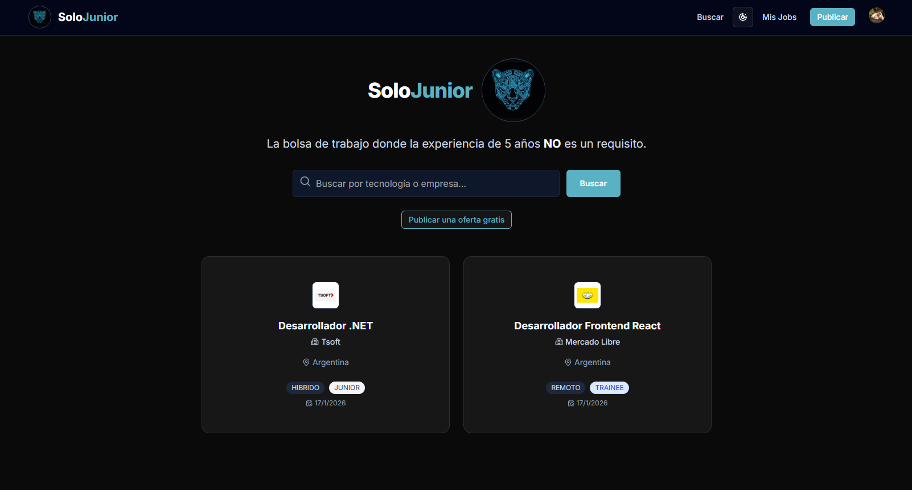

# 🐆 SoloJunior - Bolsa de Trabajo para Juniors/Trainee/Pasantias


**SoloJunior** es una plataforma web moderna diseñada exclusivamente para conectar desarrolladores Trainee y Junior con sus primeras oportunidades laborales, eliminando la barrera absurda de "se requieren 5 años de experiencia".

> **Identidad:** Inspirada en la fuerza local y la tecnología, con nuestra mascota oficial: el *Yaguareté Cibernético*.

🔗 **Demo en vivo:** [https://solo-junior-e2b9pwzkd-patriciocapparellis-projects.vercel.app/](https://solo-junior-e2b9pwzkd-patriciocapparellis-projects.vercel.app/)

---

## ✨ Características Principales

### 👨‍💻 Para Postulantes
* **Exploración Intuitiva:** Buscador en tiempo real por tecnología o nombre de empresa.
* **Diseño Moderno:** Interfaz limpia con tarjetas estilo "grid", optimizada para lectura rápida.
* **Modo Oscuro/Claro:** Soporte nativo con temática personalizada **Neon Cyan (#5AB1C3)**.
* **Filtros Visuales:** Badges de colores para identificar rápidamente el Seniority (Trainee, Junior, Pasantía).

### 🏢 Para Recruiters / Empresas
* **Publicación Gratuita:** Formulario simple para subir ofertas laborales.
* **Logos de Empresa:** Integración con **UploadThing** para subir logos y darle identidad a la oferta.
* **Gestión de Ofertas:** Panel "Mis Publicaciones" para ver el historial.

### 🛡️ Seguridad y Moderación (Admin)
* **Autenticación Robusta:** Login seguro vía Google o Email usando **Clerk**.
* **Roles y Permisos:**
    * El creador de la oferta puede eliminarla.
    * **Modo Super Admin:** Permite moderar y borrar cualquier oferta inapropiada desde el frontend.

---

## 🛠️ Stack Tecnológico

El proyecto fue construido utilizando lo último del ecosistema React/Next.js (2025):

* **Frontend:** [Next.js 15 (App Router)](https://nextjs.org/), [React 19](https://react.dev/), [TypeScript](https://www.typescriptlang.org/).
* **Estilos:** [Tailwind CSS](https://tailwindcss.com/), [Shadcn UI](https://ui.shadcn.com/), Lucide Icons.
* **Backend:** Next.js Server Actions (Sin APIs REST complejas).
* **Base de Datos:** [PostgreSQL](https://www.postgresql.org/) (Serverless vía **Neon Tech**).
* **ORM:** [Prisma](https://www.prisma.io/).
* **Auth:** [Clerk](https://clerk.com/).
* **Storage:** [UploadThing](https://uploadthing.com/).
* **Deploy:** [Vercel](https://vercel.com/).

---

## 📸 Capturas de Pantalla

| Home (Dark Mode) | Detalle del Empleo |
|:---:|:---:|
|  |  |

---

## 🚀 Instalación y Configuración Local

Seguí estos pasos para correr el proyecto en tu máquina:

### 1. Clonar el repositorio
```bash
git clone [https://github.com/TU_USUARIO/SoloJunior.git](https://github.com/TU_USUARIO/SoloJunior.git)
cd SoloJunior
```
### 2. Instalar dependencias
```bash

npm install
3. Configurar variables de entorno
Creá un archivo .env en la raíz y agregá las claves necesarias:

Fragmento de código
```
### 3. Base de Datos (Neon / PostgreSQL)

DATABASE_URL="postgresql://..."

### Autenticación (Clerk)
NEXT_PUBLIC_CLERK_PUBLISHABLE_KEY=pk_test_...
CLERK_SECRET_KEY=sk_test_...

### Storage (UploadThing)
UPLOADTHING_TOKEN=...

### Admin (Tu ID de usuario de Clerk para permisos de Super Admin)
ADMIN_USER_ID=user_...

### 4. Preparar la Base de Datos
Bash

npx prisma generate
npx prisma db push
### 5. Correr el servidor
Bash

npm run dev
Abrí http://localhost:3000 y ¡listo!

## 🤝 Contribución
¡Las contribuciones son bienvenidas! Si tenés ideas para mejorar SoloJunior:

Hacé un Fork.

Creá una rama (git checkout -b feature/NuevaFeature).

Commiteá tus cambios (git commit -m 'Agregué X cosa').

Push a la rama (git push origin feature/NuevaFeature).

Abrí un Pull Request.
